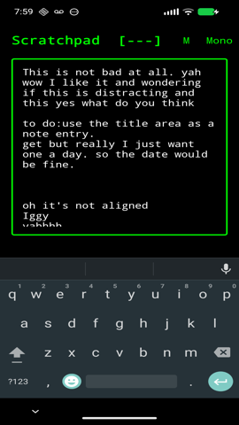

# Scratchpad

A retro-style notepad app with 1980s BBS aesthetics.

## Screenshot



## Features

- Dark theme with green-on-black terminal look
- Auto-save functionality
- Multiple notes support with note list
- Adjustable text size (S/M/L/XL)
- Export notes to Downloads folder (JSON)
- Import notes from JSON backup
- Share text from other apps to create new notes
- Trash/recycle bin with soft delete
- Restore notes from trash
- DOS 8.3 filename format for titles
- Click title in editor to edit
- Tap "Scratchpad" title for About dialog

## ADB Commands

```bash
# Backup all notes to Downloads start -n com.example.scratchpad/.MainActivity -a com.example
adb shell am.scratchpad.EXPORT

# Import notes (requires base64 encoding)
adb shell am start -n com.example.scratchpad/.MainActivity -a com.example.scratchpad.IMPORT --es base64_data "$(cat backup.json | base64)"

# Clear all notes
adb shell am start -n com.example.scratchpad/.MainActivity -a com.example.scratchpad.CLEAR

# List notes (output to logcat)
adb shell am start -n com.example.scratchpad/.MainActivity -a com.example.scratchpad.LIST

# Show about dialog
adb shell am start -n com.example.scratchpad/.MainActivity -a com.example.scratchpad.ABOUT
```

## Bugs I Know About / UX Improvements

- **FAB covers last note**: When the note list is full-screen, the floating action button (+) can cover the last note, making it difficult to tap. 
  - **Workaround**: Edit any note so it moves to the top of the list, then you can access the covered note.

## Tech Stack

- Kotlin
- Jetpack Compose
- Material 3
- Room Database

## Build

```bash
./gradlew assembleDebug
```

## Release

```bash
./gradlew assembleRelease
```
